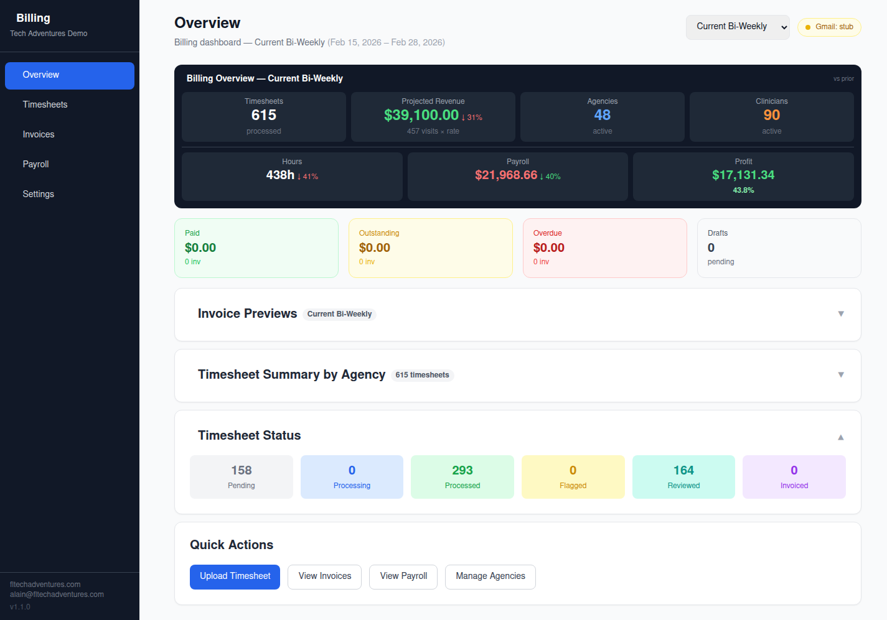

# Agency Billing Automation System

A full-stack billing automation system built for home health staffing agencies. Manages timesheets, generates invoices, tracks payroll, and provides real-time financial dashboards.

**Live Demo:** [staffing-agency-demo.fltechadventures.com](https://staffing-agency-demo.fltechadventures.com/)

<p align="center">
  
</p>

## Quick Start

```bash
git clone git@github.com:ii-am-modiify/agency-billing-app.git
cd agency-billing-app
cp .env.example .env
docker-compose up -d
```

That's it. The app auto-seeds 20,775 timesheets across 14 months of demo data on first boot.

**Open:** [http://localhost:3021](http://localhost:3021)

## What It Does

- **Timesheet Management** — Upload, OCR process, review, and approve clinical timesheets
- **Invoice Generation** — One-click invoice creation from approved timesheets with PDF generation
- **Payroll Tracking** — Clinician payroll calculations with adjustments and payment tracking
- **Billing Dashboard** — Real-time overview of revenue, hours, profit margins, and status breakdowns
- **Settings Management** — Manage agencies, clinicians, patients, and billing codes

## Tech Stack

| Layer | Tech |
|-------|------|
| Frontend | React 18 + Vite + Tailwind CSS |
| Backend | Express.js + Node 20 |
| Database | MongoDB 7 |
| PDF Generation | PDFKit (pure code, no headless browser) |
| Containerization | Docker + Docker Compose |
| Security | Helmet CSP, CORS, rate limiting, NoSQL sanitization |

## Architecture

```
┌─────────────────────────────────────────────┐
│  React SPA (Vite + Tailwind)                │
│  Landing Page → Dashboard → Pages           │
├─────────────────────────────────────────────┤
│  Express API                                │
│  /api/timesheets  /api/invoices             │
│  /api/payroll     /api/settings             │
├─────────────────────────────────────────────┤
│  MongoDB 7                                  │
│  Timesheets, Invoices, Agencies,            │
│  Clinicians, Patients, Billing Periods      │
├─────────────────────────────────────────────┤
│  PDFKit Invoice Generator                   │
│  ~7,500 PDFs/min (no Puppeteer needed)      │
└─────────────────────────────────────────────┘
```

## Demo Data

The seed script (`app/seed-demo.js`) generates realistic demo data:

- **50 agencies** (home health, staffing, nursing services)
- **100 clinicians** (RN, LPN, OT, PT, SLP, COTA, PTA)
- **3,000 patients**
- **20,775 timesheets** across 14 months (Jan 2025 → Feb 2026)
- **~672 timesheets per bi-weekly period**
- **1,500 invoices** with auto-generated PDFs
- **31 billing periods** with bi-weekly anchor on Dec 22, 2024

### Reseed Data

```bash
docker exec billing-demo-app node seed-demo.js
```

### Generate All Invoice PDFs

```bash
docker exec billing-demo-app node generate-pdfs.js
```

## Key Features

### Billing Dashboard
- Period selector (Current/Previous Bi-Weekly, Monthly, Quarterly, YTD, All Time)
- Revenue tracking with trend indicators vs prior period
- Hours, payroll, and profit margin cards
- Collapsible invoice previews and timesheet summaries

### Timesheets
- Search by patient, clinician, or agency name
- Collapsible filter panel (status, agency, clinician, care type, date range)
- 30-per-page pagination
- Upload + OCR processing pipeline

### Invoices
- Tabbed workflow: Review → Outstanding → Paid
- Click any invoice for slide-out preview
- One-click "Send to Agency" (simulated in demo)
- PDF generation via PDFKit (~7,500/min)

### Payroll
- Clinician payroll summary with hours and pay calculations
- Adjustment modal for manual corrections
- Mark Paid workflow with payment tracking
- Paid/unpaid filtering

### Settings
- Agency, Clinician, Patient, and Billing Code management
- Search + pagination (30 per page)
- Add/edit/delete with inline forms

## Security

- **Helmet** — CSP headers, X-Frame-Options, HSTS
- **CORS** — Locked to approved origins
- **Rate Limiting** — 100 req/min API, 10/5min uploads
- **NoSQL Sanitization** — Strips `$`-prefixed keys from request bodies
- **No Auth (Demo)** — Intentionally open for demo; production version adds authentication

## Project Structure

```
├── app/
│   ├── frontend/          # React + Vite + Tailwind
│   │   ├── src/
│   │   │   ├── pages/     # Overview, Timesheets, Invoices, Payroll, Settings
│   │   │   └── components/# PeriodSelector, Skeleton, etc.
│   │   └── public/        # Screenshots, static assets
│   ├── models/            # Mongoose schemas
│   ├── routes/            # Express API routes
│   ├── services/          # PDF, billing, OCR, Gmail
│   ├── middleware/         # NoSQL sanitization
│   ├── cron/              # Billing cycle, email poller (disabled in demo)
│   ├── seed-demo.js       # Demo data generator
│   ├── generate-pdfs.js   # Batch PDF generator
│   └── index.js           # Express server entry
├── Dockerfile             # Node 20 slim (no Chromium!)
├── docker-compose.yml     # App + MongoDB
├── mongo-init.js          # DB user setup
└── reset-demo.sh          # Daily reset script
```

## Environment Variables

See `.env.example` for all available config. Key vars:

| Variable | Default | Description |
|----------|---------|-------------|
| `DB_USER` | `billing` | MongoDB app user |
| `DB_PASSWORD` | `demodemo` | MongoDB app password |
| `DB_NAME` | `billing_demo` | Database name |
| `DB_ROOT_PASSWORD` | `demorootpass` | MongoDB root password |
| `APP_PORT` | `3001` | Express server port |
| `ANTHROPIC_API_KEY` | _(optional)_ | For OCR processing |

## Daily Reset (Production Demo)

For a public-facing demo, set up a cron to reset data daily:

```bash
# crontab -e
0 4 * * * /path/to/reset-demo.sh
```

## Built By

**[Tech Adventures](https://fltechadventures.com)** — Business automation, managed IT, and web development for Tampa Bay businesses.

Contact: alain@fltechadventures.com
